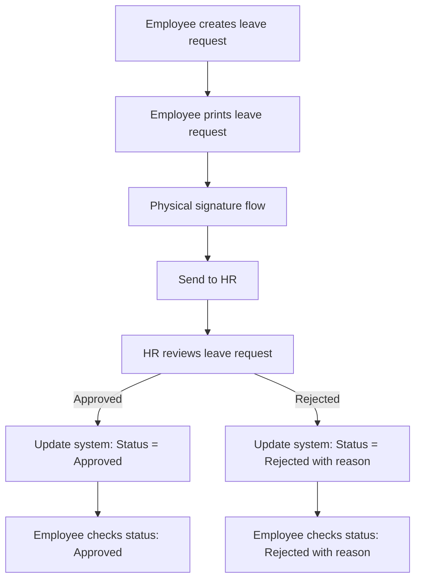

# Outline

A service can let employee ask for a leave.
the flowchart is:

in this flow, system must have those feature

+ Add a new tab askLeave
+ list the leave request at the tab
+ user can click create leave request at the top of the tab
+ in the create modal, need to fill in type @.\frontend\src\types\index.LeaveRequestForm
+ fulfill from to type @.\frontend\src\types\index.LeaveRequest and use to request API POST /leave/create to create a leave request
+ at the leave request list, user can click on '下載請假單' to download the leave request docx file
  + @frontend\src\template\leaveRequest.docx is the template
  + @test.html is the example to replace word in docx file
  + downloaded file should named '請假單{YY/mm/DD}' with the variable in type LeaveRequestForm

when login as HR, should have those feature

+ Add a new tab approveLeave
+ list all leave request (default only display created, those need to check.)
+ Can sign off request with approve/reject with a reason.

check @backend\src\config\leaveRule.json for leave option.
